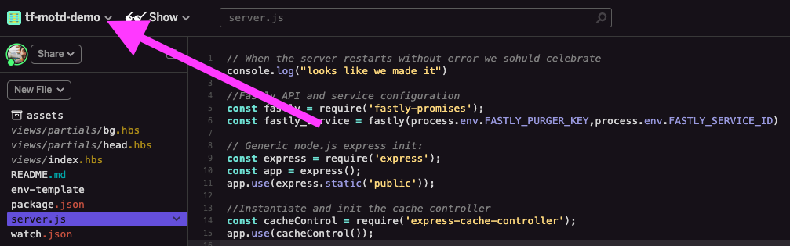
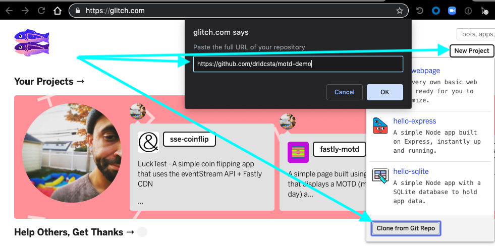
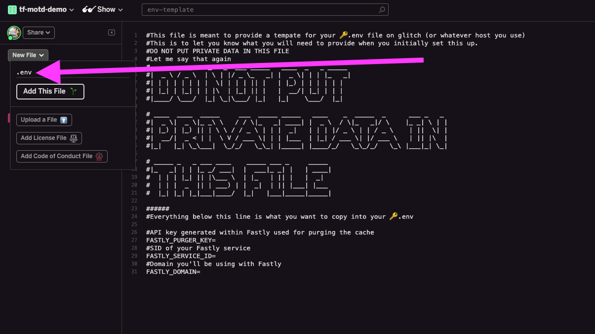

# Using Glitch With Fastly. 

### What is Glitch? 

Glitch combines a real time collaborative editing platform with a hosting service that has hooks into Github. Put another way: Glitch is Heroku with a built in editory. 

In short, it's a place to create and host apps

### How to set up glitch to work with Fatly. 

Using Glitch as an origin with Fastly is relatively easy. By default glitch creates a random subdomain for every app you create (EG: `https://solipsistic-horse.glitch.me`) however you can change that to whatever you want (EG: `https://tf-motd-demo.glitch.me`). 



Once you have your app up and running and have made note of your URL you're ready to configure fastly.

### How To set up Fastly to work with Glich

On the Fastly side you use your Glitch URL as the backend under `Origin` => `Hosts`. You can use whatever domain you like, however I suggest setting up a personal domain, and then pointing it's wildcard at Fastly. I use `*.drl.fyi` so that every new app I spin up is just `foo.drl.fyi` or `blah.drl.fyi`. 

In addition to setting up the backend and domain there are ~~three~~ two VCL snippets you need to set up (a snippet with a subroutine which goes in `init` then two snippets to call it, one for miss, one for pass)

#### miss_or_pass
* Priority: 100
* Type: init

    **SNIPPET**
```
    sub miss_or_pass {
        if (req.backend.is_origin) {
            set bereq.http.host = "tf-motd-demo.glitch.me";
        }
    }
```


#### Call set host header on miss
* Priority: 100
* Type: miss  

    **SNIPPET**  
    `call miss_or_pass;`

#### Call set host header on pass
* Priority: 100
* Type: pass  

    **SNIPPET**  
    `call miss_or_pass;`


### Using an existing app

One of the good things about Glitch is that you can import and export apps to and from Github. To do this simply go to Glitch, click the `New Project` button in the upper right hand corner, and select `Import from github` [Here](https://github.com/drldcsta/motd-demo) is a demo you can use to try things out. 




If you are using an app from the Fastly Demo Libary you should see a file called `env-template` which will list all of the environment variables that app uses. You'll have to create a `.env` file from within Glitch and populate those variables. Remember, the template is just there to tell you what you need to fill in **DO NOT PUT PRIVATE DATA IN THE TEMPLATE**



### Closing

If you've followed the steps above you should have a working app hosted on Glitch, served via fastly. **IMPORTANT NOTE:** Glitch puts apps to "sleep" after 10 minutes of inactivity however you are allowed and encouraged to set up a "keep-alive" ping so long as you stay under 10K requests per hour. If you look at the [MoTD](https://github.com/drldcsta/motd-demo) demo app you'll notice that there is a `/healthcheck/check` endpoint within the app. This is so you can point Fastly's healthchecks at this URL to keep the app from sleeping. 